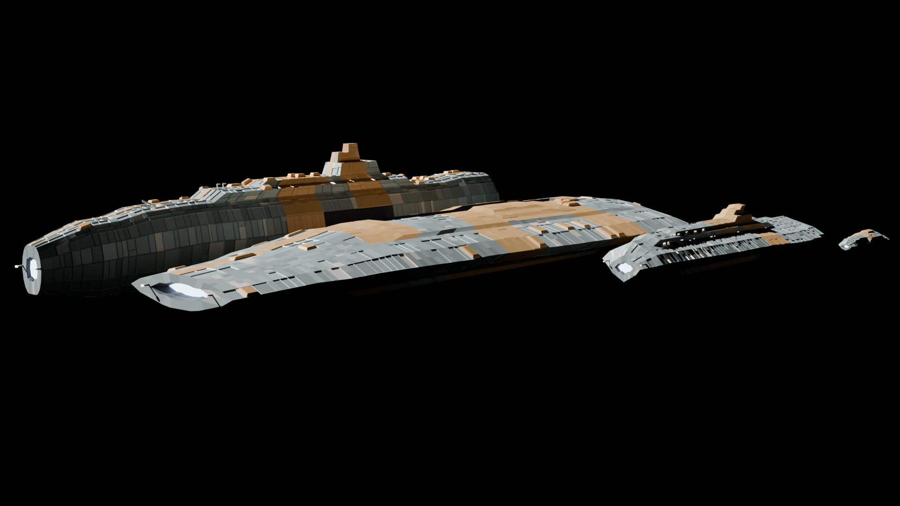
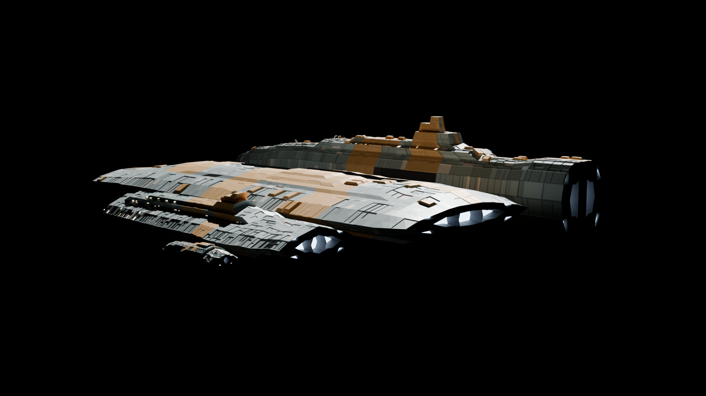

# FI ShipKit — procedural hard-sci-fi ships in Blender geometry nodes




Three generator families, each authored **entirely from Python-built
geometry-node groups** — no hand-modelled meshes, no third-party node
packs. Open a kit `.blend`, drop a group on an empty mesh, and drive the
sliders; or rebuild every kit from source with one headless command each.
Every ship above is a handful of slider values on one node group.

| kit | generator | language |
|---|---|---|
| `FI_ShipKit.blend` | `FI_FrameShip` (+ dress-pass groups) | stealth hull + working aft: flush faceted plating, machinery honest and confined to the dorsal spine / aft third |
| `FI_WarKit.blend` | `FI_WarShip` | naval blades: chined monocoque lofts, wedge prow, boat-tail stern, faction palettes (MCR / UNN / BEL), chine light-lines |
| `FI_FleetKit.blend` | `FI_FleetShip` | bright slab fleet register: plateau decks, recursive paneling, catamaran / asymmetric hull forms, running-light bands |

Requires **Blender 4.5+** (developed on 5.0). Everything runs headless.

## Quick start

```
blender -b --python build_kit.py        # -> FI_ShipKit.blend  + kit_contract.json
blender -b --python build_warkit.py     # -> FI_WarKit.blend   + war_contract.json
blender -b --python build_fleetkit.py   # -> FI_FleetKit.blend + fleet_contract.json

blender -b --python kit_selftest.py     # QA: budgets, attrs, contract, renders
blender -b --python war_selftest.py     #   (each exits non-zero on any failure)
blender -b --python fleet_selftest.py

blender -b --python make_playground.py        # example fleets ->
blender -b --python make_war_playground.py    #   *_playground.blend
blender -b --python make_fleet_playground.py
```

Selftest renders land in `out/*/`. Open a playground `.blend` to inspect
ships with live sliders (Seed, Class, faction, hull-form and dozens more
per generator).



## Conventions (the pipeline hangs on these)

- **Ships are authored nose = +X, up = +Z, true metres.** Blender's glTF
  exporter converts Y-up as (x, z, −y), so an engine reading glTF verbatim
  gets +X nose, +Y up, +Z starboard — a pure rotation, no mirror
  (`ship_export.py --probe` emits a chirality probe to verify yours).
- **Working files LINK the kits** (referenced, not appended). Rebuilding a
  kit propagates into every ship file on next open, therefore the **socket
  contract is frozen**: group/socket names and order are additive-only; a
  breaking change ships as a new group name. `*_contract.json` is
  regenerated on every build — `git diff` is the contract check.
- Masks are painted vertex groups (`FI_PanelMask`, `FI_GreebleMask`);
  the modifiers read them live.
- Greeble convention: origin at the hull-contact face, +Z out of the hull,
  +X fore-aft, footprint ~0.4–1.2 m, ≤200 tris.

## Scripts

| script | purpose |
|---|---|
| `build_kit.py` / `build_warkit.py` / `build_fleetkit.py` | regenerate each kit `.blend` from scratch (idempotent) + its contract JSON |
| `fi_gn_lib.py` | shared builder layer: the `G` node-graph builder, native deformer/selection dep groups (`fi_deps`), materials, wear shader |
| `kit_selftest.py` / `war_selftest.py` / `fleet_selftest.py` | QA after every rebuild: tri budgets, attributes, watertightness, knob sweeps, golden sums, workbench renders |
| `make_*_playground.py` | link the kits and instantiate example fleets |
| `ship_export.py` | deterministic export → `.glb` + report (`--collection`, `--auto-orient`, `--max-tris`, `--probe`) |
| `bake_ship.py` | procedural shaders → PBR texture maps (albedo/ORM/emissive/normal) → textured `.glb` |

Design documents: `FRAME_DESIGN.md` (frame-family slot grammar),
`TEXTURE_DESIGN.md` (wear-shader + bake method).

## Gotchas baked into the code (learned the hard way)

- Blender's Random Value node with an UNCONNECTED ID socket returns
  garbage in constant (non-field) contexts — `G.rand_float` always pins
  ID to a constant-0 int node.
- Write Python bools (not 0/1 ints) into bool modifier sockets — int
  writes land silently without effect.
- Geometry `Switch` nodes: typed name-lookup can grab the field variant
  of a duplicated socket name; wire by socket index where noted.
- Multi-input Join sockets concatenate in **reverse link-creation
  order**, and element order feeds index-seeded randomness downstream —
  treat element order as part of a group's contract.

## Licensing

- **Code** (all `.py`): GPL-3.0-or-later — see `LICENSE`.
- **Assets** (the kit/playground `.blend` files, docs, and original
  textures): CC-BY-4.0 — see `LICENSE-ASSETS`. Credit
  “FI ShipKit by Savannah” somewhere reasonable when redistributing the
  kit or adaptations of it.
- **Ships, renders, and games you make with the kit are entirely yours.**
  Attribution applies to redistributing the kit assets themselves (or
  your own `.blend` files that link/append the FI node groups — those
  are adaptations), not to what you create with them.
- Third-party texture provenance: `CREDITS.md`.
